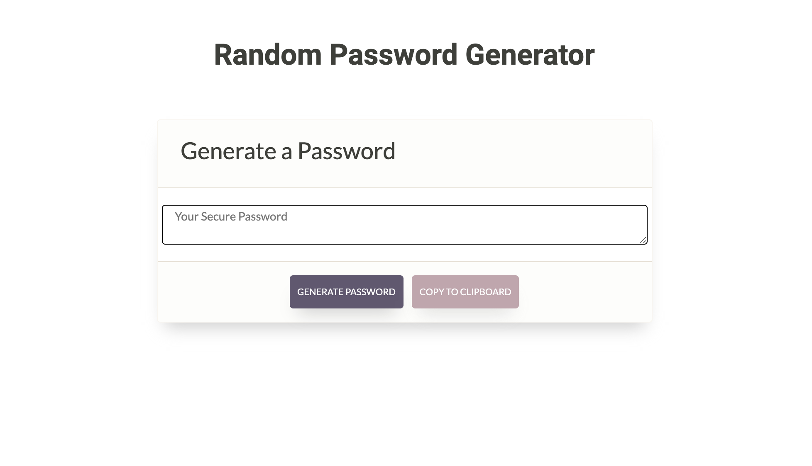

# Random Password Generator

This application is designed to generate a randomized password. The user is prompted for their choice of numerals, special characters, and letters, and is also asked to choose a length between 8-120 characters.

## Interface

I wanted to keep this application exceedingly minmal. To do this, I only included two buttons on the page— one to generate the password, and another to copy the password to the clipboard.

## Technologies

This site was written using:
* Bootstrap 4
* Javascript

## Credits

In setting up this project, I closely followed the guidelines provided by the [UCF Coding Bootcamp](https://github.com/UCF-Coding-Boot-Camp/UCF-ORL-FSF-FT-11-2019-U-C).